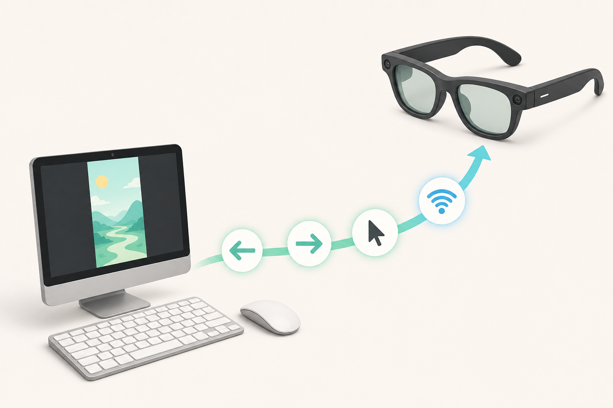
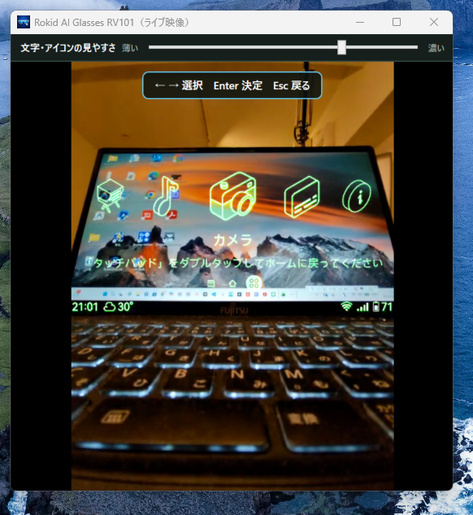
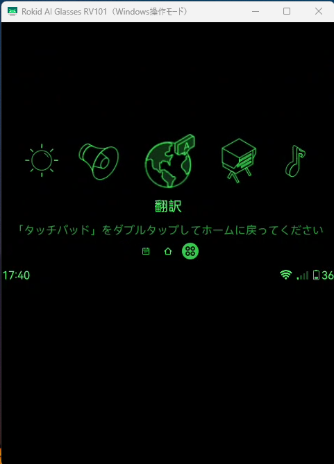

# Rokid Control

Rokid AI Glasses RV101の画面をWindowsに表示し、Windowsのマウスとキーボードで操作するアプリです。



**現在のバージョン: 0.1.0**

[最新版をダウンロード](https://github.com/ksuzukigh/rokid-windows-control/releases/latest)

## できること

- Rokidの画面をWindowsに表示する
- WindowsのマウスとキーボードでRokidを操作する
- 「ライブ映像」と「背景なし（省電力）」を選べる
- USBとWi-Fiの両方で接続できる
- Wi-Fi切断やカメラ使用後に自動でつなぎ直す

### ライブ映像

Rokidのカメラ映像を背景にして、Rokidの文字やアイコンを重ねて表示します。

Rokid純正の「カメラ」を開くと、Windowsの表示もフルカラーの撮影画面へ自動で切り替わります。カメラを閉じると、元のライブ映像へ自動で戻ります。



### 背景なし（省電力）

カメラを使わず、黒い背景にRokidの文字やアイコンを表示します。電池を節約したいときに使います。

純正「カメラ」を開いている間だけ、Windowsの表示がフルカラーの撮影画面へ切り替わります。カメラを閉じると、背景なし画面へ戻ります。



## 用意するもの

- **Rokid AI Glasses RV101**
- **Windows 11 24H2以降のx64 PC**
- **Rokidの開発用5ピンケーブル**
  RV101付属の3ピンケーブルは充電専用です。Windowsとの初回接続には使えません。開発用ケーブルはRokidの販売元またはサポートへ確認してください。
- **Windows PCとRokidを接続するWi-Fi**
- **Rokidのスマホアプリ側で開発者モード（ADB）を有効にしておくこと**
  開発用5ピンケーブルをつなぐだけではADBは有効になりません。最初の接続前に有効にしてください。

Rokidを再起動したあともケーブルなしで接続したい場合は、別公開の[Wi-Fi ON](https://github.com/ksuzukigh/rokid-wifi-on)もRokidへ入れておきます。

## Windowsに入れる

### 1. Rokid Controlをダウンロードする

[最新版のRokid Control for Windowsをダウンロード](https://github.com/ksuzukigh/rokid-windows-control/releases/latest)します。

リリースページにある`Rokid-Control-Windows-x64-<version>.zip`をダウンロードします。

### 2. ZIPを展開する

ダウンロードしたZIPを右クリックし、「すべて展開」を選びます。展開したフォルダーは、好きな場所へ置いてかまいません。

### 3. アプリを開く

展開したフォルダー内の`Rokid Control.exe`をダブルクリックします。インストールや管理者権限は必要ありません。

<details>
<summary>Windowsに確認画面が表示された場合</summary>

ダウンロードしたアプリの実行前に、Windowsが確認画面を表示することがあります。ファイル名が`Rokid Control.exe`であり、このREADMEからGitHub Releasesへ進んでダウンロードしたファイルであることを確認してから、画面の案内に従ってください。

Windowsのセキュリティ設定によって実行が許可されない場合は、そのPCでは利用できません。保護機能を無効にする必要はありません。

</details>

## Rokidと初めて接続する

1. スマートフォンのRokidアプリで、開発者モード（ADB）を有効にします。
2. Windows PCとRokidを同じWi-Fiへつなぎます。
3. Rokidの電源を入れ、開発用5ピンケーブルでWindows PCとつなぎます。
4. `Rokid Control.exe`を開きます。
5. Rokid側にUSB接続の確認が表示された場合は許可します。
6. 「ライブ映像」または「背景なし（省電力）」を選びます。
7. WindowsにRokidの画面が表示されたら接続完了です。5ピンケーブルは外せます。

接続には少し時間がかかることがあります。待つのをやめる場合は「キャンセル」を押します。

## 普段の使い方

1. Windows PCとRokidを同じWi-Fiへつなぎます。
2. `Rokid Control.exe`を開きます。
3. 「ライブ映像」または「背景なし（省電力）」を選びます。
4. 表示されたRokid画面を一度クリックしてから操作します。

初回設定後は、普段の接続に開発用5ピンケーブルは必要ありません。Wi-Fiが一時的に切れた場合は自動でつなぎ直します。

ライブ映像はRokidのカメラを使うため、「背景なし（省電力）」より電池を消費します。表示方法を変える場合は、Rokid Controlを一度終了して開き直します。

## Rokidを再起動したあと

1. Rokidのアプリ一覧から「Wi-Fi ON」を開きます。
2. 「Wi-Fiに接続しました」と表示されるまで待ちます。
3. Windowsで`Rokid Control.exe`を開きます。

接続できない場合は、開発用5ピンケーブルでWindows PCとRokidをつないでから`Rokid Control.exe`を開きます。

## キーボード操作

Windowsに表示されたRokidの画面を一度クリックしてから操作します。ほかのアプリを操作している間は、そのアプリへキーが入力されます。

| キー | 動作 |
| --- | --- |
| `M` | メモを開く |
| `H` | Homeを開く |
| `A` | アプリ一覧を開く |
| `Esc` | 一つ前に戻る |
| `←` / `→` | `A`を押したあと、アプリを選ぶ |
| `Enter` | `A`を押したあと、選んだアプリを開く |
| `Ctrl` + `Q` | Rokid Controlを終了 |

`M`・`H`・`A`は、Rokidがどの画面を表示していても、1回押すだけでその項目を開きます。

`A`でアプリ一覧を開くと、左右キーと`Enter`が使えるようになります。アプリを開いて`Esc`で一覧へ戻ったあとも、そのまま左右キーで選び直せます。`H`、`M`、またはライブ映像を直接操作すると、アプリ選びを終えます。

## うまく接続できないとき

1. Windows PCとRokidが同じWi-Fiにつながっているか確認します。
2. Rokidで「Wi-Fi ON」を開き、「Wi-Fiに接続しました」と表示されるまで待ちます。
3. `Rokid Control.exe`を一度終了して開き直します。
4. それでも接続できない場合は、開発用5ピンケーブルでWindows PCとRokidをつなぎます。
5. Rokid側にUSB接続の確認が表示された場合は許可します。

Rokid以外のAndroid端末がUSB接続されている場合は、誤操作を避けるため外してください。

<details>
<summary>キーが動かない場合</summary>

1. Windowsに表示されたRokidの画面を一度クリックします。
2. 左右キーと`Enter`は、`A`でアプリ一覧を開いてから使えます。
3. ほかのWindowsアプリを選んでいる場合は、Rokidの画面をもう一度クリックします。

</details>

<details>
<summary>ライブ映像が表示されない場合</summary>

1. Rokid純正「カメラ」など、カメラを使うアプリを終了します。
2. 数秒待って、ライブ映像へ戻るか確認します。
3. 改善しない場合は、「背景なし（省電力）」を選びます。

</details>

## 終了する

Rokid Controlのウインドウ右上にある「×」を押します。`Alt` + `F4`または`Ctrl` + `Q`でも終了できます。

## 削除するには

1. Rokid Controlを終了します。
2. 展開したRokid Controlのフォルダーを削除します。
3. 保存済みの接続先や設定、ログも削除したい場合は、`%LOCALAPPDATA%\Rokid Control`フォルダーを削除します。

## 安全性について

- Rokidの画面、ライブ映像、操作データは、Windows PCとRokidの間で直接送受信します。
- 画面、映像、操作データをクラウドへ送りません。
- ほかのアプリで入力した文字は記録せず、Rokidへも送りません。
- 無線接続には、初回USB認証で登録したPCだけが接続できる暗号化方式を使います。

自宅など、信頼できるWi-Fiでお使いください。

## 注意

- Rokid AI Glasses RV101用です。
- ライブ映像はRokidのカメラを継続して使うため、電池を多く消費します。
- 公共のWi-Fiでは使用しないでください。

## 関連アプリ

- [Wi-Fi ON](https://github.com/ksuzukigh/rokid-wifi-on)：Rokid AI Glasses RV101のWi-Fiを復旧します。

## ライセンス

本アプリのソースコードは[Apache License 2.0](LICENSE)で公開しています。同梱しているscrcpyとAndroid Platform Toolsなどのライセンスは、アプリ内の`Licenses`フォルダーに収録しています。

<details>
<summary>開発者向けの詳しい情報</summary>

Windows版は.NET 10 SDKで作成しています。開発用のビルド、検証、パッケージ作成の手順は次のとおりです。

```powershell
.\tools\verify.ps1
.\tools\prepare-vendor.ps1
.\tools\package.ps1 -Version 0.1.0
```

仕様は[仕様書](docs/SPECIFICATION.md)、検証結果は[技術試験計画](docs/TECHNICAL-TEST-PLAN.md)、配布方針は[配布方針](docs/CODE-SIGNING.md)を参照してください。

</details>
